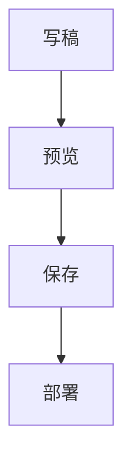

# Hexo Markdown

跨平台 Hexo 博客编辑器：左边写 Markdown，右边实时预览；粘贴图片可上传到 **Cloudflare R2**；可通过 **SSH / SFTP** 同步文章，并在服务器上执行 `hexo generate` / `hexo deploy`。可接入 **OpenAI 兼容的外部 LLM** 做续写、润色、扩写。

支持 **Windows / macOS / Linux**。当前版本见 [Releases](https://github.com/Songxwn/hexo-markdown/releases)。

---

## 目录

- [能做什么](#能做什么)
- [下载与安装](#下载与安装)
- [使用教程](#使用教程)
  - [第一次打开](#1-第一次打开)
  - [界面说明](#2-界面说明)
  - [写一篇文章](#3-写一篇文章)
  - [图片](#4-图片)
  - [预览、大纲与大图](#5-预览大纲与大图)
  - [外观、字体和字号](#6-外观字体和字号)
  - [远程同步与发布](#7-远程同步与发布)
  - [LLM 协助编辑](#8-llm-协助编辑)
- [配置 Cloudflare R2](#配置-cloudflare-r2)
- [配置 SSH / SFTP](#配置-ssh--sftp)
- [配置 LLM](#配置-llm)
- [快捷键](#快捷键)
- [常见问题](#常见问题)
- [开发](#开发)
- [打包与 GitHub 自动编译](#打包与-github-自动编译)

---

## 能做什么

- 编辑 `source/_posts`、`source/_drafts`，实时预览 GFM（表格、任务列表、代码高亮、**Mermaid 流程图**）
- 识别常见 Hexo 标签：`asset_img`、`img`、`blockquote`、`codeblock`、`raw`
- 新建文章套用模板；文件名只用标题，**不加日期前缀**（日期写在 front-matter）
- 粘贴 / 拖入 / 工具栏选图：有 R2 则上传并插入公开 URL；没有则存到文章资源目录
- 预览同步滚动、标题大纲、单击图片放大、Mermaid 流程图
- **LLM 协助编辑**：续写 / 润色 / 扩写 / 缩写 / 翻译，可接 OpenAI、DeepSeek、通义、Kimi、Ollama 等
- 四种皮肤、六种字体、12–20px 字号
- **已发布**列表走远程 SFTP，打开即可改服务器上的文章
- SSH 远程执行生成 / 部署，底部有日志

---

## 下载与安装

1. 打开 [Releases](https://github.com/Songxwn/hexo-markdown/releases)，下载对应系统的安装包：
   - Windows：`Hexo Markdown-Setup-*.exe`（NSIS 安装包）
   - macOS：`.dmg`
   - Linux：`.AppImage`
2. 安装或运行后打开应用。首次启动会弹出**设置**，需要先绑定本地 Hexo 根目录。

从源码运行见文末[开发](#开发)。

---

## 使用教程

下面按日常写作顺序说明。快捷键里的 `Ctrl` 在 macOS 上换成 `⌘`。

### 1. 第一次打开

1. 点右上角齿轮，或菜单 **文件 → 设置…**（`Ctrl+,`）。
2. 在 **本地 Hexo** 里填写博客根目录，或点「浏览」选择。必须是站点根目录（里面有 `_config.yml`），**不要**选 `source/_posts`。
3. 目录里应有 `_config.yml` 和 `source/_posts`；`source/_drafts` 可选。
4. 点 **保存设置**。标题栏下方会显示当前博客路径。

配置只存在本机，不会上传。密钥类字段保存后再次打开会显示掩码，留空表示不修改。

配置文件位置：

| 系统 | 路径 |
| --- | --- |
| Windows | `%APPDATA%\hexo-markdown\data\config.json` |
| macOS | `~/Library/Application Support/Hexo Markdown/data/config.json` |
| Linux | `~/.config/hexo-markdown/data/config.json` |

开发时也可把项目根目录的 `.env` 当作初始默认值，见 `.env.example`。

### 2. 界面说明

```
┌ 标题栏：博客路径 · 当前文章 · 新建 / 保存 / 设置 ─────────────┐
│ 侧栏          │ 工具栏（标题/粗体/图片/大纲/LLM）                 │
│ 全部/已发布/草稿│ 远程栏（连接、拉取、推送、生成、部署、日志）     │
│ 搜索 + 列表    │ 左：源码编辑 │ LLM（可选）│ 右：预览  │ 大纲（可选）│
└ 状态栏：保存状态 · 路径 · 字数 · SSH / LLM / R2 · 版本 ──────────┘
```

**左侧列表**

| 标签 | 内容 |
| --- | --- |
| **全部** | 本地 `source/_posts` 与 `source/_drafts` |
| **已发布** | 服务器上的 `source/_posts`（需先配置并连接 SSH） |
| **草稿** | 本地 `source/_drafts` |

列表项可打开、重命名、删除。顶部搜索框按标题、文件名、路径过滤。

**中间工作区**

- 拖动编辑器和预览之间的竖条，可改左右宽度。
- 未打开文章时，中间是引导页。
- 远程文章标题前会标「远程 ·」，保存会直接写回服务器。

### 3. 写一篇文章

**新建**

1. 选好左侧标签：在「全部 / 草稿」是写到本地；在「已发布」是直接在服务器 `source/_posts` 新建（必须已连接 SSH）。
2. 点标题栏 **新建**，或 `Ctrl+N`。
3. 填标题，选模板，本地还可选「已发布」或「草稿」。
4. 文件名由标题生成（空格变 `-`，去掉非法字符），例如标题 `你好 世界` → `你好-世界.md`，路径类似 `source/_posts/你好-世界.md`。
5. 点 **创建**。模板里的 `{{ title }}`、`{{ date }}`、`{{ slug }}` 会替换成当前标题、时间和文件名片段；`date` 会写成此刻时间。

**编辑与保存**

- 左边改源码，右边即时预览。
- `Ctrl+S` 或点 **保存**。未保存时标题旁有圆点，状态栏显示「未保存」。切换文章或关闭窗口会提醒。
- 工具栏可给选中文字加标题、粗体、斜体、行内代码、链接、引用、列表。
- 编辑器支持 Tab 缩进。

**重命名**

Hexo 默认常用文件名当 permalink。点状态栏路径，或菜单 **文件 → 重命名文件…**，也可在列表里改。弹窗会预览新文件名和链接片段。同名资源目录（`文章名/`）会一起改。

**删除**

在列表里删除。本地文章删本地文件；「已发布」里删的是服务器上的文件。请确认后再删。

**文章模板**

在 **设置 → 文章模板**：

- 可新建、改名、编辑、删除模板，并把其中一个设为默认。
- 占位符：`{{ title }}`、`{{ date }}`、`{{ slug }}`。
- 若博客目录有 `scaffolds/post.md`、`scaffolds/draft.md`，新建时也会出现在模板列表中（只读，改 Hexo 脚手架文件即可）。

### 4. 图片

三种插入方式效果相同：

- 在编辑器里 **粘贴** 截图或图片
- **拖入** 图片文件
- 工具栏 **图片按钮** 选文件

流程：先插入占位 ``，成功后再换成最终地址。图片说明默认为空，需要时再自己在 `` 的方括号里填写。

**已配置 R2**

上传到 Cloudflare R2，插入公开 URL，形如：

```markdown

```

对象键默认前缀 `hexo`，可在设置里改。

**未配置 R2**

保存到当前文章旁边的资源目录，例如：

- 文章：`source/_posts/hello.md`
- 图片：`source/_posts/hello/paste-20260820-143000.png`

Markdown 里写相对文件名。预览会按 Hexo 文章资源目录解析；远程文章则从服务器读图。

独立成行的 `` 会在预览里显示图片，并在下方用 alt（或 title）作为题注。

### 5. 预览、大纲与大图

- 预览支持 GFM、Mermaid 流程图，以及上面列出的 Hexo 标签。
- 拖左边源码滚动时，右边预览会跟到对应段落。
- **大纲**：`Ctrl+Shift+O` 或工具栏大纲按钮。点击标题会同时跳转预览和编辑器；预览滚动时会高亮当前标题。
- **单击预览中的图片** 全屏查看。再单击图片或空白处关闭；也可点「关闭」或按 `Esc`。滚轮缩放，放大后可拖动（拖动不会关掉）。
- 预览里的 `http(s)` 链接用系统浏览器打开，不会在应用内跳转。

在预览中渲染流程图，使用 `mermaid` 或 `mmd` 代码块：

````markdown

````

也支持 Hexo 标签 ` ... `。语法错误时预览会显示报错，源码仍可见。皮肤切换后流程图会按浅色 / 深色重绘。

### 6. 外观、字体和字号

在 **设置** 顶部，或菜单 **视图**：

| 项目 | 选项 | 说明 |
| --- | --- | --- |
| 外观 | 墨色 / 宣纸 / 夜航 / 青瓷 | 点选即预览，保存后写入配置 |
| 字体 | 默认、系统、黑体、宋体、楷体、等宽 | 作用于界面、编辑器和预览 |
| 文字大小 | 12–20 px，标准 14 | 只放大文字，不缩放图片 |

快捷键：`Ctrl+=` 增大，`Ctrl+-` 减小，`Ctrl+0` 重置。设置里点选可先预览，取消则还原；保存后才写入配置。

### 7. 远程同步与发布

适用于博客源码在服务器上、本机用这款编辑器改稿的情况。先完成 [SSH 配置](#配置-ssh--sftp)。

**推荐流程**

1. 点远程栏插头图标（或菜单 **远程 → 连接 SSH**）。连上后状态栏和远程栏会显示 `用户@主机`。
2. **已发布**：左侧列表实时列出服务器 `source/_posts`。打开后直接改远程文件，**保存即写回服务器**，不必再点「推送当前」。
3. **本地草稿 / 全部**：在本机 `source/_drafts` 或本地 posts 里写。可用「从服务器拉取」把远程文章下到本地；改完后「推送当前」或「推送全部」。
4. 可选：设置里勾选 **保存文章后自动 SFTP 上传**（只对本地文章生效：保存后自动推送该 Markdown 和同名资源目录）。
5. 推送完成后，用 **生成**、**部署** 或火箭按钮 **生成并部署**，在服务器博客目录执行 Hexo 命令。
6. 点远程栏日志按钮查看输出；失败时先看这里。

**远程栏按钮**

| 按钮 | 作用 |
| --- | --- |
| 插头 | 连接 / 断开 SSH |
| 下载 | 从服务器拉取 `source/_posts`、`source/_drafts` 及文章资源目录到本地 |
| 上传 | 推送**当前**本地文章（远程文章请直接保存） |
| 云朵 | 推送全部本地文章 |
| 生成 | 远程 `npx hexo generate`（可在设置里改命令） |
| 部署 | 远程 `npx hexo deploy` |
| 火箭 | 先生成再部署 |
| 日志 | 打开底部远程日志 |

命令通过 `bash -lc` 执行，并会先跑「登录初始化」（默认尝试加载 nvm / `.bashrc`），以便找到 `node` 和 `hexo`。

### 8. LLM 协助编辑

先完成 [LLM 配置](#配置-llm)。打开一篇文章后：

1. 点工具栏星星按钮，或菜单 **视图 → LLM 协助**（`Ctrl+Shift+L`）。面板出现在源码编辑器右侧。
2. 可选中一段文字再操作；没有选区则按**全文**处理。
3. 点 **续写 / 润色 / 扩写 / 缩写 / 译中 / 译英**，或填写自定义指令后点 **按指令生成**。自定义框也可当作补充要求，和快捷按钮一起用。
4. 生成过程中可 **停止**。完成后选择：
   - **插入光标**：写到当前光标处
   - **替换选区**：换成当前选中的文字（无选区则等于插入）
   - **替换全文**：用结果覆盖整篇
5. 结果是 Markdown，会尽量去掉模型包一层的代码围栏。请再通读一遍再保存。

请求走应用主进程，避免浏览器跨域，API Key 也不会出现在页面网络面板里。

---

## 配置 Cloudflare R2

图片希望用 CDN 公开地址时再配。整组留空则走本地/远程文章资源目录。

1. 在 Cloudflare 创建 R2 存储桶。
2. 开启公开访问：绑定自定义域名，或使用 `r2.dev` 公开子域。
3. 创建 **R2 API Token**（该桶 Object Read & Write），记下：
   - Account ID（仪表盘右栏或 R2 概览）
   - Access Key ID、Secret Access Key
   - Bucket 名
   - 公开访问 URL（不要末尾斜杠），例如 `https://img.example.com` 或 `https://pub-xxxx.r2.dev`
4. 在应用 **设置 → Cloudflare R2** 填入。对象键前缀默认 `hexo`，实际上传路径类似 `hexo/2026/08/20/abc123-封面.png`。插入 Markdown 的链接为「公开 URL + 对象键」。

Access Key 不是 Cloudflare 登录邮箱。Secret 只显示一次；已经保存过的可留空，不会被清空。

---

## 配置 SSH / SFTP

在 **设置 → SSH / SFTP** 填写：

| 项 | 说明 |
| --- | --- |
| 主机 / 端口 / 用户名 | 端口一般是 `22`。主机不要带 `ssh://` |
| 密码 或 私钥 | 二选一，推荐私钥（OpenSSH 的 `id_ed25519` / `id_rsa`，不要选 `.pub`）。PuTTY `.ppk` 需先转换成 OpenSSH |
| 私钥口令 | 创建密钥时设过 passphrase 再填 |
| 远程 Hexo 根目录 | 服务器上的**绝对路径**，且含 `_config.yml`，例如 `/home/ubuntu/blog` |
| 登录初始化 | 连上后、进博客目录前执行，用来加载 nvm / node。多条用 `;` 连接 |
| 生成 / 部署命令 | 默认 `npx hexo generate`、`npx hexo deploy`。也可写成 `hexo g` 或 `npx hexo generate --deploy` |

用户需要对远程博客目录有读写权限。密码和私钥已保存时，再次打开设置留空表示不改。

---

## 配置 LLM

在 **设置 → LLM 协助** 填写 OpenAI 兼容接口。点选预设会填入地址和默认模型：

| 预设 | 接口地址 | 默认模型 |
| --- | --- | --- |
| OpenAI | `https://api.openai.com/v1` | `gpt-4o-mini` |
| DeepSeek | `https://api.deepseek.com` | `deepseek-chat` |
| 通义千问 | `https://dashscope.aliyuncs.com/compatible-mode/v1` | `qwen-plus` |
| Kimi | `https://api.moonshot.cn/v1` | `moonshot-v1-auto` |
| 智谱 | `https://open.bigmodel.cn/api/paas/v4` | `glm-4-flash` |
| 硅基流动 | `https://api.siliconflow.cn/v1` | `deepseek-ai/DeepSeek-V3` |
| OpenRouter | `https://openrouter.ai/api/v1` | `openai/gpt-4o-mini` |
| Ollama | `http://127.0.0.1:11434/v1` | `qwen2.5` |

地址填到 `/v1`（或服务商给出的 compatible 根路径）即可，应用会补上 `/chat/completions`。若你粘贴的已经是完整 completions URL，则原样使用。

- **模型名**必须和服务商控制台一致。
- **API Key**：云服务必填；本地 Ollama 可留空。已保存过的 Key 再次打开设置留空表示不修改。
- 也可用其它兼容网关（One API、New API、Azure OpenAI 完整 URL 等），只要走 `chat/completions`。

配置保存在本机用户数据目录，不会上传。

---

## 快捷键

| 操作 | Windows / Linux | macOS |
| --- | --- | --- |
| 新建文章 | `Ctrl+N` | `⌘N` |
| 保存 | `Ctrl+S` | `⌘S` |
| 设置 | `Ctrl+,` | `⌘,` |
| 大纲 | `Ctrl+Shift+O` | `⌘⇧O` |
| LLM 协助 | `Ctrl+Shift+L` | `⌘⇧L` |
| 增大文字 | `Ctrl+=` | `⌘=` |
| 减小文字 | `Ctrl+-` | `⌘-` |
| 重置文字大小 | `Ctrl+0` | `⌘0` |
| 推送当前文章 | `Ctrl+Shift+U` | `⌘⇧U` |
| 生成并部署 | `Ctrl+Shift+D` | `⌘⇧D` |
| 撤销 / 重做 | `Ctrl+Z` / `Ctrl+Y` | `⌘Z` / `⌘⇧Z` |
| 关闭大图预览 | `Esc` | `Esc` |

---

## 常见问题

**设置里提示找不到 `_config.yml`**  
路径应指向 Hexo 站点根（和 `_config.yml` 同级），不是 `source` 或 `_posts`。

**「已发布」是空的，或提示未连接**  
先在设置里填好 SSH 并保存，再点远程栏连接。已发布列表读的是**服务器**上的文章，不是本地 `_posts`。

**保存了但网站没更新**  
本地保存只改文件。要让站点变，需推到服务器（远程文章保存即写回），再执行生成 / 部署。看底部远程日志确认命令是否成功。

**远程生成报找不到 hexo / node**  
在「登录初始化」里 source 你的 nvm 或 bashrc，例如：

```bash
source ~/.nvm/nvm.sh 2>/dev/null || true; source ~/.bashrc 2>/dev/null || true
```

**粘贴图片失败**  
看提示。未配 R2 时会写到文章资源目录，需要已经打开一篇文章。配了 R2 则检查 Account ID、密钥、桶名和公开 URL。

**预览里相对路径图片不显示**  
确认图片在「文章名同名目录」下，Markdown 用文件名或 `./文件名`。远程文章需保持 SSH 连接。

**想改文章链接**  
改文件名（重命名），不要只改标题。本应用新建时文件名不含 `2026-08-20-` 这种日期前缀。

**字变大了连图片一起变**  
请用「视图 → 文字大小」，不要用系统级页面缩放。字号只影响文字。

**LLM 请求失败**  
确认接口地址是 OpenAI 兼容的 `/v1` 或完整 `.../chat/completions`，模型名与控制台一致，Key 有效。Ollama 需先在本机 `ollama serve` 并拉好模型，Key 可留空。公司网关若禁止流式输出，应用会在报错信息含 stream 时自动改成非流式重试。

---

## 开发

需要 Node.js 18+。

```bash
npm install
npm run dev
```

会同时启动 Vite 和 Electron。在应用设置里填写本地 Hexo 根目录、R2、SSH 和 LLM。

---

## 打包与 GitHub 自动编译

```bash
# 当前系统安装包
npm run dist

# 指定平台
npm run dist:win
npm run dist:mac
npm run dist:linux
```

产物在 `release/`。跨平台打包通常要在对应系统上执行（例如在 macOS 上打 dmg）。

推送到 `main` 或提交 Pull Request 后，[Build](.github/workflows/build.yml) 会在 Windows / macOS / Linux 上分别打包：

- 推送 `main`：更新预发布 **Latest build**
- 推送 `v*` 标签：发布正式版本

```bash
git tag v1.2.6
git push origin v1.2.6
```
